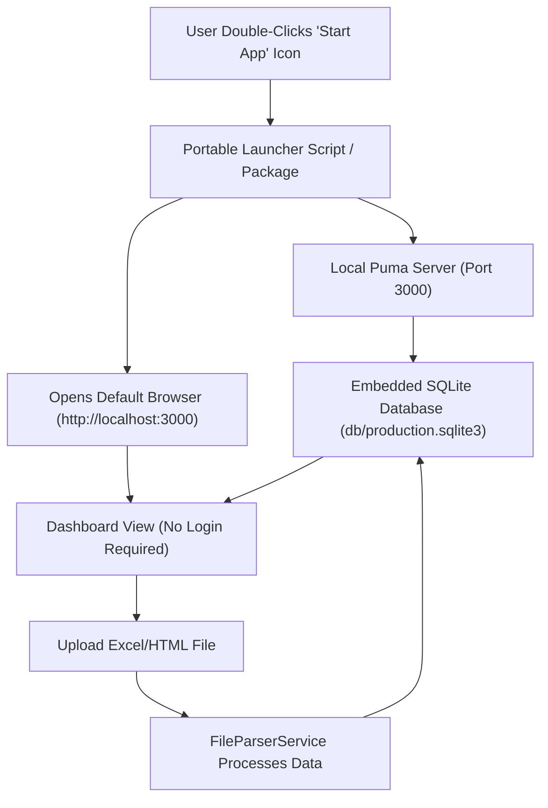

# Implementation Plan: Offline, Zero-Config Local BI-Ticket App

Transition the BI-Ticket Ruby on Rails application from a PostgreSQL/VPS server setup to a **fully offline, zero-configuration local application** that runs with a **one-click action** and allows non-technical users to access the dashboard directly without logging in, while maintaining all existing upload, parsing, chart generation, and datatable features.

---

## Technical Approach & Architecture Strategy

> [!NOTE]
> **Why Embedded Database (SQLite3) is the ideal solution:**
> You mentioned wanting an app "without database" because you don't want users to install PostgreSQL.
> SQLite3 is an **embedded zero-configuration database** that stores all data in a single local file (`db/production.sqlite3`). It requires **zero installation or database server software** on the user's computer. It runs inside the application automatically.
> Using SQLite3 allows keeping 100% of your existing Ruby parsing logic (`Roo`, `Nokogiri`, `FileParserService`), Active Record queries, `Chartkick`, and filters intact!

---

## User Review Required

> [!IMPORTANT]
> **Database & Architecture Choice:**
> We recommend **SQLite3 + Local Launcher** (Option 1). This keeps all your current code working perfectly while eliminating PostgreSQL completely.
>
> Please confirm if you prefer:
> 1. **Option 1 (Recommended): Embedded SQLite3 + One-Click Local App Launcher** — Retains existing Rails code, uses zero-config SQLite file, instant setup for end-users, 1-click desktop launch.
> 2. **Option 2: Pure Client-Side Single Page Application (SPA in HTML/JS)** — Rewrites backend parsing and chart logic into browser JavaScript (using IndexedDB).

> [!TIP]
> **Login Bypass:**
> The app will be updated so that opening the app lands directly on the **Dashboard (`/dashboard`)**. The login screen is completely bypassed for local offline use.

---

## Proposed Changes

### Database Configuration & Dependencies

#### [MODIFY] [Gemfile](file:///home/ubuntu20046/projects/other/BI-Ticket/Gemfile)
- Replace `gem "pg"` with `gem "sqlite3", "~> 1.6"`.

#### [MODIFY] [config/database.yml](file:///home/ubuntu20046/projects/other/BI-Ticket/config/database.yml)
- Update default, development, test, and production adapters to `sqlite3`.
- Set database storage paths to `db/development.sqlite3` and `db/production.sqlite3`.

---

### Routing & Authentication Bypass

#### [MODIFY] [config/routes.rb](file:///home/ubuntu20046/projects/other/BI-Ticket/config/routes.rb)
- Change root route `root "sessions#new"` to `root "dashboard#index"`.

#### [MODIFY] [app/controllers/application_controller.rb](file:///home/ubuntu20046/projects/other/BI-Ticket/app/controllers/application_controller.rb)
- Modify `require_login` check to skip authentication requirement for offline local mode or make it optional.

---

### One-Click Desktop Launchers

#### [NEW] `start_app.bat` (Windows 1-Click Launcher)
- Script for Windows users to launch local server and open default browser automatically.

#### [NEW] `start_app.sh` (macOS / Linux 1-Click Launcher)
- Executable shell script to launch local server and open browser automatically.

---

## Verification Plan

### Automated Verification
- Run database migrations with SQLite3: `bin/rails db:prepare`
- Verify database schema generation (`db/schema.rb`).

### Manual Verification
- Launch application locally in production/offline mode.
- Access `http://localhost:3000` to confirm it loads the Dashboard directly without asking for login.
- Test uploading `.xlsx`, `.xls`, and `.html` ticket files.
- Verify chart updates (tickets by category, status, time series, age buckets) and datatable pagination.
- Verify data persistence across server restarts (data saved to local SQLite file).
